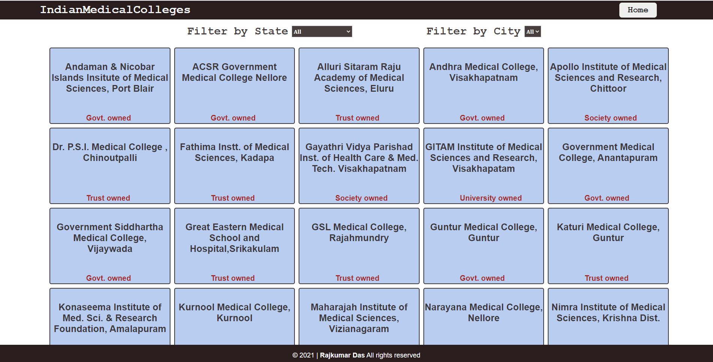
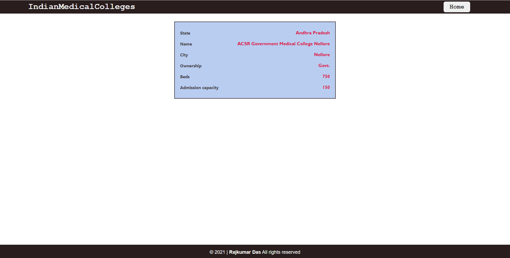
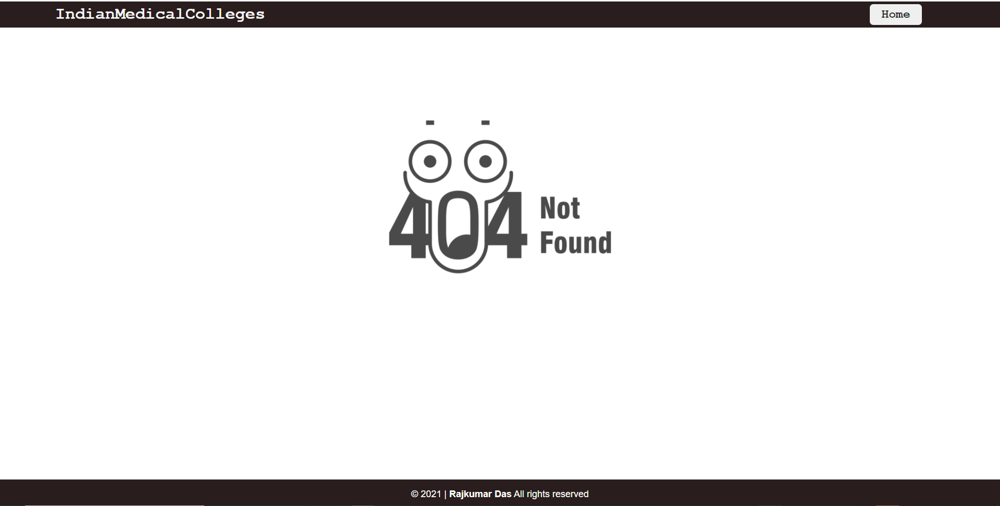

# Indian Medical Colleges

> This project is built using React and Redux

## Project Description

This is a React app created using the React library which gives list of all the Medical Colleges in India.
You can also click on any of the college tile to see the available seats and beds for patients which is good to know in advance during this pandemic situation.
This app is based on Catalogue of Statistics as you have an option to filter your state and city to view hospitals of your choice.

## Built With

- React
- HTML and CSS
- Heroku
- Eslint and Stylelint as linters
- React Testing library and Jest for DOM and Snapshot testing

## Live Demo

[Demo Link](https://indian-medical-colleges-2021.netlify.app/)

## Project Setup

- Fork this GitHub repository
- Clone the repository to your machine
- Run 'npm install' to install the project dependencies
- Run 'npm start' to load the application on your browser
- Above command should open this URL http://localhost:8080/ on your browser.

### `npm start`

Runs the app in the development mode.\
Open [http://localhost:3000](http://localhost:3000) to view it in the browser.

The page will reload if you make edits.\
You will also see any lint errors in the console.

### `npm test`

Launches the test runner in the interactive watch mode.\

## Authors

👤 **Rajkumar Das**

- Github: [@rajkumardas2701](https://github.com/rajkumardas2701)
- Twitter: [@Rajkuma58621299](https://twitter.com/Rajkuma58621299)
- Linkedin: [Rajkumar Das](https://www.linkedin.com/in/rajkumar-das-41308961/)

## 🤝 Contributing

Contributions, issues and feature requests are welcome!

Feel free to check the [issues page](https://github.com/rajkumardas2701/medical-colleges/issues).

## Show your support

Give a ⭐️ if you like this project!

## 📝 License

This project is [MIT](lic.url) licensed.